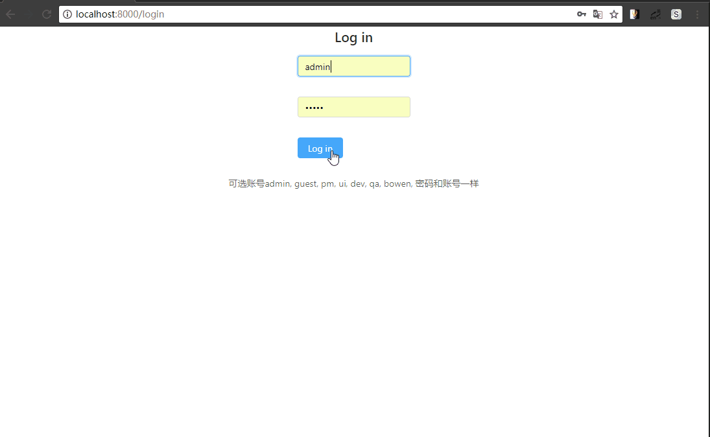

# dva-antd-admin
> 使用[dva-cli](https://github.com/dvajs/dva)搭起的架子，`菜单` `路由` `权限`三者耦合的案例。
> 效果：
## Todo
- [x] 从`路由配置`生成可访问菜单和路由
- [x] `ProtectedRoute`，需要验证权限的路由，权限不符合则渲染`NotAllowed`
- [x] `ProtectedButton`，需要验证权限的按钮，权限不符合则不渲染
- [ ] 自动生成面包屑
- [ ] 菜单高亮问题
## 参考项目
> [vue-element-admin](https://github.com/PanJiaChen/vue-element-admin)、[antd-admin](https://github.com/zuiidea/antd-admin)
、[bird-front](https://github.com/liuxx001/bird-front)、

